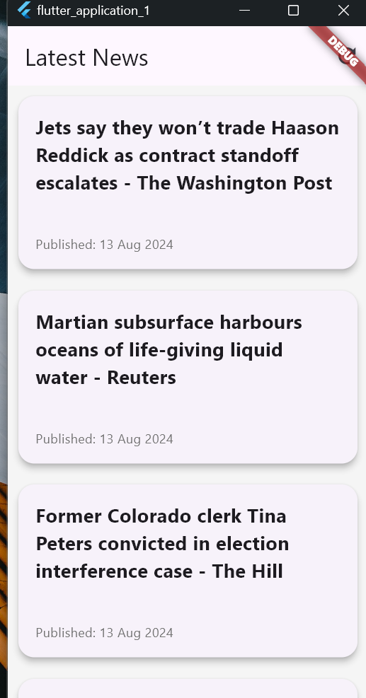
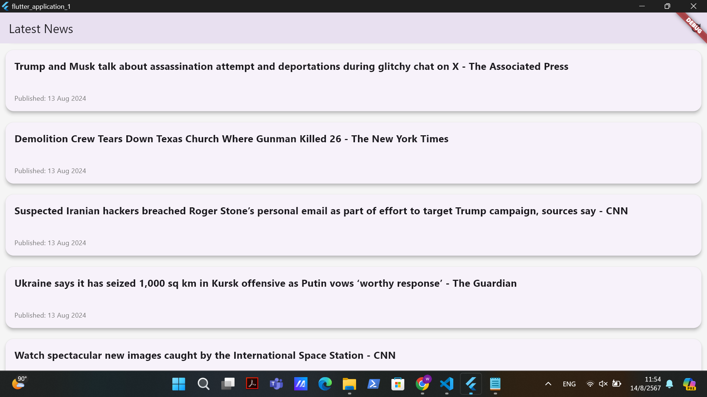

# แอปข่าวล่าสุด


ยินดีต้อนรับสู่ **แอปข่าวล่าสุด** แอปพลิเคชัน Flutter ที่เรียบง่ายและทันสมัยซึ่งดึงและแสดงพาดหัวข่าวล่าสุด แอปนี้ใช้ News API เพื่อดึงข้อมูลข่าวสารล่าสุดและแสดงในรูปแบบที่เป็นมิตรต่อผู้ใช้

## คุณสมบัติ

- **ดึงข่าวล่าสุด**: ดึงพาดหัวข่าวล่าสุดจาก News API
- **รีเฟรชและโหลดเพิ่มเติม**: ดึงเพื่อรีเฟรชและอัปเดตข่าวสาร
- **การจัดการข้อผิดพลาด**: แสดงข้อความข้อผิดพลาดหากข่าวไม่สามารถโหลดได้
- **UI ที่สวยงาม**: การออกแบบที่สะอาดและตอบสนองได้ดีพร้อมเลย์เอาต์แบบการ์ด

## ภาพตัวอย่าง




## เริ่มต้นใช้งาน

ในการเริ่มต้นใช้งานแอปนี้ โปรดทำตามขั้นตอนดังต่อไปนี้:

### ข้อกำหนดเบื้องต้น

- SDK Flutter

### การติดตั้ง

1. โคลนรีพอซิทอรีนี้:
   ```bash
   git clone https://github.com/username/repository.git
   ```
2. เปลี่ยนไปยังไดเรกทอรีของโปรเจค:
   ```bash
   cd repository
   ```
3. ติดตั้งแพคเกจที่จำเป็น:
   ```bash
   flutter pub get
   ```

### การรันแอป

1. เชื่อมต่ออุปกรณ์หรือเปิดโปรแกรมจำลอง:
2. รันแอป:
   ```bash
   flutter run
   ```

## การใช้งาน

เมื่อเปิดแอป คุณจะเห็นพาดหัวข่าวล่าสุดจาก News API พร้อมตัวเลือกในการรีเฟรชเพื่อดึงข่าวใหม่

## ข้อมูลเพิ่มเติม

- **News API**: [ข่าว API](https://newsapi.org/)
- **Flutter**: [เอกสาร Flutter](https://flutter.dev/docs)

## การมีส่วนร่วม

หากคุณต้องการมีส่วนร่วมกับโปรเจคนี้ โปรดส่งคำขอ pull หรือเปิด issue สำหรับข้อผิดพลาดหรือคำแนะนำ

## การติดต่อ

หากคุณมีคำถามเพิ่มเติม หรือข้อเสนอแนะใดๆ สามารถติดต่อเราได้ที่ [อีเมลของคุณ](mailto:you@example.com)

---
